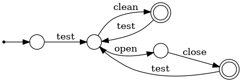
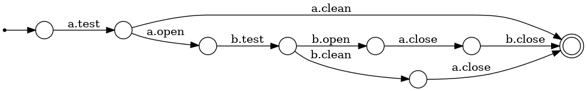
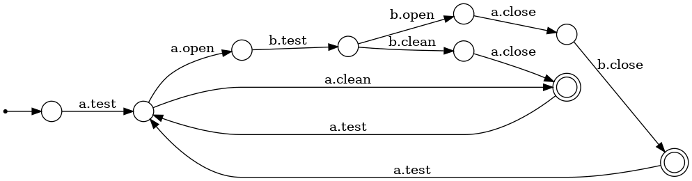
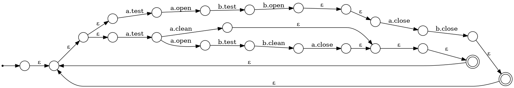

# Shelley
*by Carlos Mão de Ferro, Tiago Cogumbreiro, Francisco Martins*

Shelley is a framework for model checking call ordering on hierarchical systems.

# Paper latest version
_[updated on Apr 15 12:15 PM PT]_

[Shelley: a framework for model checking call ordering on hierarchical systems (PDF)](paper/main-0396e4a.pdf)

# Demo Video

[](https://www.youtube.com/watch?v=ZiGPZRQHTWc "Shelley demo on YouTube")

The structure of this document:

1. [Setting up the Container](#1-setting-up-the-container)
2. [Running example](#2-running-example)
3. [Aquamote use case](#3-aquamote-use-case)
4. [Running the test suite](#5-running-the-test-suite)

The structure of this container:

- `/shelley/`: Source code for the Shelley framework.
- `/demos/`: Running examples and use cases.
- `/shelleybench/`: Auxiliary tools for the benchmarking framework.
- `/test-suite/`: Datasets, scripts and experimental evaluation results.

## 1. Setting up the Container

First, [install and start Docker](https://docs.docker.com/get-started/).

1. Build container:

   ```bash
   $ make -f host.mk build
   ```

2. To enter the container with an interactive terminal session, run:

   ```bash
   $ make -f host.mk run
   ```


## 2 Paper running example

_Note: For all the examples below, please make sure you access the bash in the container first._

### 2.1 Generating the files in *Listing 2.1*

#### A. For generating `Valve` and `AppV1` Shelley specifications:
   
```bash
   # On the container:
   $ cd demos/paper_running_example_appv1
   $ ls
      ... app.py  uses.yml  valve.py
   $ shelley-makefile --optimize # generates Makefile
   $ ls
      ... Makefile  app.py  uses.yml  valve.py   
   $ make clean && make # generates Shelley files and runs the model checking
      ... rm -f *.scy *.pdf *.png *.gv *-stats.json *.int *.smv *.shy   
      ... shelleypy app.py --optimize  -o app.shy
      ... shelleypy valve.py --optimize  -o valve.shy
      ... make valve.scy
      ... shelleymc -u uses.yml -s valve.shy  
      ... make valve_extended.scy
      ... shelleymc -u uses.yml -s valve_extended.shy  
      ... make app.scy
      ... shelleymc -u uses.yml -s app.shy  
      ... make app_extended.scy
      ... shelleymc -u uses.yml -s app_extended.shy
   $ ls
      ... Makefile  app.scy  app_extended-i.scy  app_extended.scy  uses.yml  valve.scy  valve_extended.scy
          app.py    app.shy  app_extended-i.smv  app_extended.shy  valve.py  valve.shy  valve_extended.shy
   ```
In this case, `Valve` is in `valve.shy` and `AppV1` is in `app_extended.shy`.

#### B. For generating `Valve`, `Sector` and `AppV2` Shelley specifications:
   
```bash
   # On the container:
   $ cd demos/paper_running_example_appv2
   $ ls
      ... app.py  sector.py  uses.yml  valve.py
   $ shelley-makefile --optimize # generates Makefile
   $ ls
      ... Makefile  app.py  sector.py  uses.yml  valve.py   
   $ make clean && make # generates Shelley files and runs the model checking
      ... rm -f *.scy *.pdf *.png *.gv *-stats.json *.int *.smv *.shy
      ... shelleypy app.py --optimize  -o app.shy
      ... shelleypy valve.py --optimize  -o valve.shy
      ... shelleypy sector.py --optimize  -o sector.shy
      ... make valve.scy
      ... shelleymc -u uses.yml -s valve.shy  
      ... make valve_extended.scy
      ... shelleymc -u uses.yml -s valve_extended.shy  
      ... make sector.scy
      ... shelleymc -u uses.yml -s sector.shy  
      ... make sector_extended.scy
      ... shelleymc -u uses.yml -s sector_extended.shy  
      ... make app.scy
      ... shelleymc -u uses.yml -s app.shy  
      ... make app_extended.scy
      ... shelleymc -u uses.yml -s app_extended.shy   
   $ ls
      ... Makefile  app.scy  app_extended.scy  sector.py   sector.shy             sector_extended-i.smv  sector_extended.shy  valve.py   valve.shy           valve_extended.shy
          app.py    app.shy  app_extended.shy  sector.scy  sector_extended-i.scy  sector_extended.scy    uses.yml             valve.scy  valve_extended.scy
   ```
In this case, `Valve` is in `valve.shy`, `Sector` is in `sector_extended.shy` and `AppV2` is in `app_extended.shy`.

### 2.2 Class `Valve` and diagram in *Listing 2.2*

Class `Valve` is identical for both the `AppV1` and `AppV2`.

Here, we choose to generate the diagram for `demos/paper_running_example_appv1/valve.py`.

Make sure that the Shelley specification files have been generated has described above.

```bash
   # On the container:
   $ cd demos/paper_running_example_appv1
   $ make valve.png # generate the diagram as a PNG
      ... shelleyv --format png valve.scy -o valve.png
   $ make valve.pdf # generate the diagram as a PDF
      ... shelleyv --format pdf valve.scy -o valve.pdf  
```



### 2.3 Class `AppV1` and diagram in *Listing 2.3*

We generate the diagram for `demos/paper_running_example_appv1/app.py`.

Make sure that the Shelley specification files have been generated has described above.

```bash
   # On the container:
   $ cd demos/paper_running_example_appv1
   $  make app_extended-i-d.png # generate the diagram as a PNG
      ... shelleyv --dfa --minimize --nfa-no-sink --dfa-no-sink  --format png app_extended-i.scy -o app_extended-i-d.png
```



### 2.4 Classes `Sector` and `AppV2` and diagram in *Listing 2.4*

We generate the diagram for `demos/paper_running_example_appv2/sector.py`. 

Class `AppV2` can be found in `demos/paper_running_example_appv2/app.py`.

Make sure that the Shelley specification files have been generated has described above.

```bash
   # On the container:
   $ cd demos/paper_running_example_appv2
   $ make sector_extended-i-d.png # generate the diagram as a PNG
      ... shelleyv --dfa --minimize --nfa-no-sink --dfa-no-sink  --format png sector_extended-i.scy -o sector_extended-i-d.png
```



### 2.5 Introduce fault to get the verification error in page 5 (first)

Fault: Comment line 19 (`b.open()`) in class `App` `demos/paper_running_example_appv1/app.py`.

```bash
   # On the container:
   $ cd demos/paper_running_example_appv1
   $ make clean && make
      ... rm -f *.scy *.pdf *.png *.gv *-stats.json *.int *.smv *.shy
      ... shelleypy app.py --optimize  -o app.shy
      ... WARNING:shelleypy:Expecting ['open'] but found self.a.close. The first subsystem call should match the case name! (l. 20)
      ... shelleypy valve.py --optimize  -o valve.shy
      ... make valve.scy
      ... shelleymc -u uses.yml -s valve.shy  
      ... make valve_extended.scy
      ... shelleymc -u uses.yml -s valve_extended.shy  
      ... make app.scy
      ... shelleymc -u uses.yml -s app.shy  
      ... make app_extended.scy
      ... shelleymc -u uses.yml -s app_extended.shy  
      ... Invalid device: integration error
            * system: main, main_1
            * integration: a.test, a.open, b.test, a.close, b.close
                                                            ^^^^^^^
            Instance errors:
            
              'b': test, close
                         ^^^^^
            
      ... make[1]: *** [../common.mk:22: app_extended.scy] Error 255
      ... make: *** [Makefile:18: scy] Error 2   
```

### 2.6 Introduce fault to get the verification error in page 5 (second)

Fault: Comment lines 12-31 and uncomment lines 34-53 in class `App` `demos/paper_running_example_appv1/app.py`.

Note that the formula `(!b.open) W a.open` is equivalent to `((! b.open) U a.open) | (G (! b.open))` and in the paper we manually wrote the former for simplification.

```bash
   # On the container:
   $ cd demos/paper_running_example_appv1
   $ make clean && make
      ... shelleypy app.py --optimize  -o app.shy
      ... shelleypy valve.py --optimize  -o valve.shy
      ... make valve.scy
      ... shelleymc -u uses.yml -s valve.shy  
      ... make valve_extended.scy
      ... shelleymc -u uses.yml -s valve_extended.shy  
      ... make app.scy
      ... shelleymc -u uses.yml -s app.shy  
      ... make app_extended.scy
      ... shelleymc -u uses.yml -s app_extended.shy  
      ... Error in specification: INTEGRATION CHECKS
          Formula: ((! b.open) U a.open) | (G (! b.open))
          Counter example: b_test; b_open; a_test; a_clean; b_close
      ... make[1]: *** [../common.mk:22: app_extended.scy] Error 255
      ... make: *** [Makefile:18: scy] Error 2
```

### 2.7 Diagram in *Fig. 2*

We generate the diagram for `demos/paper_running_example_appv2/sector.py`.

Make sure that the Shelley specification files have been generated has described above.

```bash
   # On the container:
   $ cd demos/paper_running_example_appv2
   $ make sector_extended-i-n.png # generate the diagram as a PNG
      ... shelleyv --nfa-no-sink --format png sector_extended-i.scy -o sector_extended-i-n.png
```



## 3. Aquamote use case

_For all the examples below, please make sure you access the bash in the container first._

The Aquamote use case source code is available in `demos/paper_aquamote_example`.

### 3.1 For generating Shelley specifications and run the verification

```bash
   # On the container:
   $ cd demos/paper_aquamote_example
   $ ls
      ... app.py  controller.py  http.py  power.py  sectors.py  timer.py  uses.yml  valve.py  wifi.py  wireless.py
   $ shelley-makefile --optimize # generates Makefile
   $ ls
      ... Makefile  app.py  controller.py  http.py  power.py  sectors.py  timer.py  uses.yml  valve.py  wifi.py  wireless.py   
   $ make clean && make # generates Shelley files and runs the model checking
      ... rm -f *.scy *.pdf *.png *.gv *-stats.json *.int *.smv *.shy
      ... shelleypy wifi.py --optimize  -o wifi.shy
      ... shelleypy controller.py --optimize  -o controller.shy
      ... shelleypy wireless.py --optimize  -o wireless.shy
      ... shelleypy timer.py --optimize  -o timer.shy
      ... shelleypy http.py --optimize  -o http.shy
      ... shelleypy app.py --optimize  -o app.shy
      ... shelleypy valve.py --optimize  -o valve.shy
      ... shelleypy sectors.py --optimize  -o sectors.shy
      ... shelleypy power.py --optimize  -o power.shy
      ... make valve.scy
      ... shelleymc -u uses.yml -s valve.shy  
      ... make valve_extended.scy
      ... shelleymc -u uses.yml -s valve_extended.shy  
      ... make timer.scy
      ... shelleymc -u uses.yml -s timer.shy  
      ... make timer_extended.scy
      ... shelleymc -u uses.yml -s timer_extended.shy  
      ... make power.scy
      ... shelleymc -u uses.yml -s power.shy  
      ... make power_extended.scy
      ... shelleymc -u uses.yml -s power_extended.shy  
      ... make sectors.scy
      ... shelleymc -u uses.yml -s sectors.shy  
      ... make sectors_extended.scy
      ... shelleymc -u uses.yml -s sectors_extended.shy  
      ... make wifi.scy
      ... shelleymc -u uses.yml -s wifi.shy  
      ... make wifi_extended.scy
      ... shelleymc -u uses.yml -s wifi_extended.shy  
      ... make http.scy
      ... shelleymc -u uses.yml -s http.shy  
      ... make http_extended.scy
      ... shelleymc -u uses.yml -s http_extended.shy  
      ... make wireless.scy
      ... shelleymc -u uses.yml -s wireless.shy  
      ... make wireless_extended.scy
      ... shelleymc -u uses.yml -s wireless_extended.shy  
      ... make controller.scy
      ... shelleymc -u uses.yml -s controller.shy  
      ... make controller_extended.scy
      ... shelleymc -u uses.yml -s controller_extended.shy  
      ... make app.scy
      ... shelleymc -u uses.yml -s app.shy  
      ... make app_extended.scy
      ... shelleymc -u uses.yml -s app_extended.shy
   $ ls
      ... Makefile            controller.scy             http.smv            sectors.scy             timer.shy           wifi.py            wireless.smv
          app.py              controller.shy             http_extended.scy   sectors.shy             timer_extended.scy  wifi.scy           wireless_extended-i.scy
          app.scy             controller_extended-i.scy  http_extended.shy   sectors.smv             timer_extended.shy  wifi.shy           wireless_extended-i.smv
          app.shy             controller_extended-i.smv  power.py            sectors_extended-i.scy  uses.yml            wifi.smv           wireless_extended.scy
          app_extended-i.scy  controller_extended.scy    power.scy           sectors_extended-i.smv  valve.py            wifi_extended.scy  wireless_extended.shy
          app_extended-i.smv  controller_extended.shy    power.shy           sectors_extended.scy    valve.scy           wifi_extended.shy
          app_extended.scy    http.py                    power_extended.scy  sectors_extended.shy    valve.shy           wireless.py
          app_extended.shy    http.scy                   power_extended.shy  timer.py                valve_extended.scy  wireless.scy
          controller.py       http.shy                   sectors.py          timer.scy               valve_extended.shy  wireless.shy
   ```

### 3.2 Introduce fault as shown in Example 1 (first)

Fault: Comment line 23 to omit the call `self.v1.off()` in class `Sectors` in `demos/paper_aquamote_example/sectors.py`.

```bash
   # On the container:
   $ cd demos/paper_aquamote_example
   $ make clean && make
      ...
      ... shelleypy sectors.py --optimize  -o sectors.shy
      ...
      ... make sectors.scy
      ... shelleymc -u uses.yml -s sectors.shy  
      ... make sectors_extended.scy
      ... shelleymc -u uses.yml -s sectors_extended.shy  
         Invalid device: integration error
         
         * system: sector1
         * integration: v1.on, t.wait
                        ^^^^^        
         Instance errors:
         
           'v1': on
                 ^^
      
      ... make[1]: *** [../common.mk:22: sectors_extended.scy] Error 255
      ... make: *** [Makefile:32: deps] Error 2
```

### 3.3 Introduce fault as shown in Example 1 (second)

Fault: Duplicate call `t.wait()` in line 22 in class `Sectors` in `demos/paper_aquamote_example/sectors.py`.

```bash
   # On the container:
   $ cd demos/paper_aquamote_example
   $ make clean && make
      ...
      ... shelleypy sectors.py --optimize  -o sectors.shy
      ...
      ... make sectors.scy
      ... shelleymc -u uses.yml -s sectors.shy  
      ... make sectors_extended.scy
      ... shelleymc -u uses.yml -s sectors_extended.shy  
          Error in specification: INTEGRATION CHECKS
          Formula: G ((v1.on -> (X (t.wait & (X v1.off)))) & ((v2.on -> (X (t.wait & (X v2.off)))) & ((v3.on -> (X (t.wait & (X v3.off)))) & (v4.on -> (X (t.wait & (X v4.off)))))))
          Counter example: v2_on; t_wait; v2_off; v1_on; t_wait; t_wait; v1_off
      ... make[1]: *** [../common.mk:22: sectors_extended.scy] Error 255
      ... make: *** [Makefile:32: deps] Error 2
```

## 4. Running the test suite

The test suite contains 285 Shelley specifications.

All tests can be executed by running:

```bash
   # On the container:
   $ cd /app/test-suite
   $ make clean && make
```