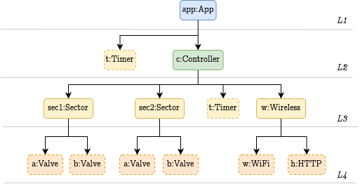

# Aquamote use case

## How to verify

```shell
# auto generate a makefile
$: shelley-makefile

# Generate Shelley specifications and models and run the model checker
$: make

# Visualizing the interface behavior
$: make controller.png

# Visualizing the implementation behavior
$: make controller_exteneded-i-d.png

# Clean all generated files
$: make clean
```

## About this use case

Aquamote is a wireless controller that switches water valves according to a scheduled irrigation plan.

The controller periodically synchronizes with a server to retrieve information about the type of irrigation plan that should be used and suspends itself to conserve battery power and then resumes periodically to synchronize with the server and to execute the irrigation plan.

The Aquamote controller is used on irrigation installations where there are water valves (also called solenoids) connected to sprinklers that deliver water for a certain area (also called sector).

Sprinklers are passive mechanical pieces since they get activated simply by the water flow while valves are electromechanical pieces of hardware that can be operated in an on/off manner in order to control the water flow.

For this use case, we assume that the controller handles two sectors, where each sector consists of two valves.
Thus, the controller can control at most 4 water valves.

The process of irrigation consists of activating each sector by trying to open both valves in a sequential manner.

However, depending on the kind of irrigation, we can try to activate all sectors at the same time and wait for a certain amount of time before deactivating (parallel mode), 

The later mode is preferred when there is a reduced water flow and it is the mode used by default.

